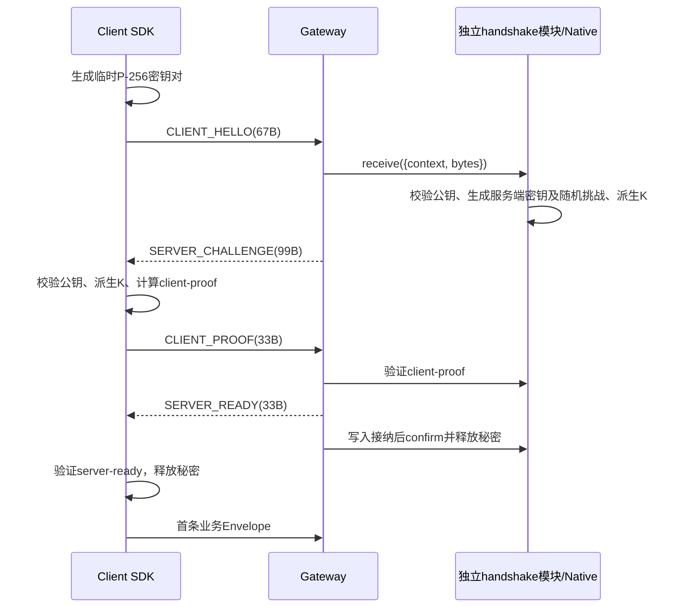

# Gateway 完整接入指南

本文面向第一次接入 FlyWow 的宿主开发者。按第1～9步完成后，可以通过 Unity TCP 或 H5 WebSocket 完成握手并收发一条 Echo 请求。业务不编写握手算法，也不接触客户端fd。

相关文档：[模块合同](README.md)、[握手字节与SDK合同](握手合同.md)、[模块文档标准](../模块标准.md)。下列路径相对**宿主 Server 根目录**；FlyWow源码相对`FLYWOW_ROOT`。示例是接入模板，需要在宿主新建所列文件，不修改框架源码。

## 1. 确定版本与职责

| 提供者 | 必须提供的内容 |
| --- | --- |
| FlyWow | Gateway Service、transport、握手状态机及Native绑定、registry生成器、codec、endpoint、Unity/H5握手SDK |
| 宿主Server | 固定Skynet/Lua、lua-protobuf、业务.proto及生成物、config.gateway、业务handler、启动/停止组装 |
| 宿主Client | 连接地址、业务Protobuf生成物、业务请求编号及响应匹配、应用层断线策略 |

基线是Skynet v1.8.0及其修改版Lua 5.4.7；Native以C++14和OpenSSL 3 libcrypto EVP构建，当前验收OpenSSL 3.5.5。Unity SDK目标netstandard2.1，固定BouncyCastle.Cryptography 2.6.2；构建入口校验NuGet包SHA256。Unity项目还需自行固定其Google.Protobuf依赖。H5需要Web Crypto和WebSocket，以及HTTPS或localhost安全上下文。

发布固定FlyWow提交，Client与Server使用相同握手版本；开发才通过`FLYWOW_ROOT`指定独立源码。当前新增握手尚未发布时，旧submodule没有这些文件，必须指向包含实现的开发源码。这里不填写伪造的发布SHA。

## 2. 准备宿主目录与运行依赖

```text
host-server/
  third_party/skynet/                  固定Skynet（含已构建skynet、Lua与cservice）
  third_party/lua-protobuf-runtime/    匹配Skynet Lua ABI的pb.so
  third_party/skynet-flywow/           固定FlyWow submodule
  protocol/echo.proto                 唯一业务协议源
  protocol/echo.pb                    protoc生成的FileDescriptorSet
  lualib/protocol/echo_registry.lua    框架生成器生成
  luaclib/flywow_gateway_crypto.so     框架Native构建产物
  config/skynet.lua                    Skynet进程配置
  config/gateway.lua                   Gateway默认配置
  service/main.lua                    宿主组装入口
  service/echo_handler.lua             宿主业务Service
```

先按宿主依赖管理流程准备并构建Skynet、protoc和lua-protobuf；`pb.so`必须使用固定Skynet自带Lua头/ABI构建，不能换成系统Lua。FlyWow不下载或编译Skynet，不提供宿主地图、账号或业务模块。

从宿主Server根目录执行：

```bash
# Build边界：显式选择源码和输出目录；不启动服务。
export FLYWOW_ROOT="$(pwd)/third_party/skynet-flywow"
mkdir -p luaclib lualib/protocol protocol
bash "$FLYWOW_ROOT/scripts/build_gateway_crypto.sh" \
  "$(pwd)/third_party/skynet" "$(pwd)/luaclib"
```

需要C++14编译器、pkg-config及OpenSSL 3的libcrypto开发文件（发行版可能统一包含在OpenSSL开发包中）。构建查询`pkg-config libcrypto`，只链接`libcrypto`；部署需要匹配的`libcrypto.so.3`，不需要`libssl`，这里不启用SSL/TLS。预期输出`FLYWOW_GATEWAY_CRYPTO_BUILT`。宿主固定实际OpenSSL包版本；缺少.so或动态依赖时启动失败，没有跳过握手的配置。

## 3. 新建业务协议并生成产物

新建`protocol/echo.proto`：

```proto
// 职责：声明示例宿主的Echo协议；Build/Client/Server共享唯一源。
// 生命周期：生成descriptor与客户端代码后随宿主版本发布；不定义框架握手。
syntax = "proto3";
package example.gateway;
option csharp_namespace = "FlyWowExample.Protocol";

message Envelope
{
    uint32 protocol_version = 1; // 宿主业务版本，示例为3。
    uint32 command          = 2; // 与rpc的command_id对应。
    uint64 request_id       = 3; // 请求关联编号，客户端请求不能为0。
    bytes  body             = 4; // 对应request/response序列化字节。
}
message EchoRequest
{
    string text = 1; // 示例输入，由宿主业务处理。
}
message EchoResponse
{
    string text  = 1; // 成功返回的文本。
    string error = 2; // 示例业务错误；空字符串表示成功。
}
service EchoService
{
    // command_id=1001
    rpc Echo(EchoRequest) returns (EchoResponse);
}
```

`command_id`是稳定线上编号，必须紧邻rpc声明，不能重复或复用给另一种不兼容消息。当前生成器接受proto3、package、Envelope和单层消息/rpc形态；不把完整Proto语法解析、跨文件类型解析或嵌套类型支持当作现有能力。

```bash
# 使用宿主固定的protoc；--include_imports生成完整FileDescriptorSet。
protoc -I protocol --include_imports \
  --descriptor_set_out=protocol/echo.pb protocol/echo.proto
python3 "$FLYWOW_ROOT/tools/generate_gateway_registry.py" \
  --proto protocol/echo.proto \
  --output lualib/protocol/echo_registry.lua
```

确认两个文件生成成功。Gateway运行时不读.proto，也不需要业务手工注册command。协议变更后一起重建descriptor、registry和客户端代码。

Unity客户端生成示例（`CLIENT_PROJECT`由调用者指向其Unity工程）：

```bash
mkdir -p "$CLIENT_PROJECT/Assets/Generated"
protoc -I protocol --csharp_out="$CLIENT_PROJECT/Assets/Generated" protocol/echo.proto
```

H5业务选择宿主现有的Protobuf工具链生成编码/解码代码，保持相同字段和uint64语义；握手SDK不绑定某个JavaScript Protobuf库。第8步另给无需该库的固定Echo字节示例。

## 4. 新建进程与Gateway配置

配置字段、生成命令、运行时读取者和 `start` 调用生命周期的可复制版本见[Gateway配置示例](flywow_gateway_config.example.lua)。以下片段展示接入流程中的关键位置；复制示例后，再按宿主的协议 bundle、端口和资源预算修改。

新建`config/skynet.lua`，在宿主Server根目录启动：

```lua
-- 职责：组装固定运行时搜索路径；进程启动一次读取，不处理业务。
local skynet_root = "./third_party/skynet/"
local flywow_root = "$FLYWOW_ROOT" -- Skynet配置加载器替换已导出的环境变量。
thread    = 4 -- Skynet工作OS线程数；按宿主部署选择。
harbor    = 0 -- 示例单进程。
start     = "main" -- service/main.lua。
bootstrap = "snlua bootstrap" -- 固定Skynet入口。
luaservice = "./service/?.lua;" .. flywow_root .. "/service/?.lua;" .. skynet_root .. "service/?.lua"
lualoader  = skynet_root .. "lualib/loader.lua"
lua_path   = "./?.lua;./lualib/?.lua;" .. flywow_root .. "/lualib/?.lua;" ..
             skynet_root .. "lualib/?.lua;" .. skynet_root .. "lualib/?/init.lua"
lua_cpath  = "./luaclib/?.so;./third_party/lua-protobuf-runtime/?.so;" .. skynet_root .. "luaclib/?.so"
cpath      = skynet_root .. "cservice/?.so"
```

`luaservice`负责找到Service入口；`lua_path`负责普通Lua模块和`config.gateway`；`lua_cpath`负责`pb`及`flywow_gateway_crypto`。三个路径职责不同，必须同时配置。

新建`config/gateway.lua`：

```lua
-- 职责：宿主Gateway静态默认值；每个实例start时读取并复制，不包含运行期Service handle。
return
{
    host                          = "127.0.0.1", -- 监听地址；部署时由宿主确定。
    port                          = 19001, -- 示例TCP端口。
    transport                     = "tcp", -- tcp或websocket，启动后固定。
    descriptor_path               = "./protocol/echo.pb", -- 相对Server启动目录。
    registry_module               = "protocol.echo_registry", -- require模块名，不带.lua。
    protocol_version              = 3, -- 宿主Envelope版本，Client必须相同。
    max_clients                   = 1024, -- 当前实例总连接上限，包含未ready连接。
    max_pending_handshakes        = 128, -- 当前实例待握手上限，不能大于max_clients。
    handshake_timeout_ticks       = 1000, -- 总握手期限10秒，tick=10ms。
    read_timeout_ticks            = 3000, -- TCP每次定长读/WS Upgrade期限30秒。
    idle_timeout_ticks            = 30000, -- WS完整消息空闲期限300秒。
    max_frame_bytes               = 65535, -- 业务Envelope最大字节数，不含TCP长度头。
    max_requests_per_second       = 200, -- 每连接固定一秒窗口的业务帧上限。
    max_total_requests_per_second = 10000, -- 当前实例固定一秒窗口的业务帧上限。
    write_warning_close_kb        = 1024, -- 写缓冲warning关闭阈值，单位KB。
}
```

### 全部配置字段

下表是框架默认值和实际校验范围；宿主配置可以覆盖默认值。整数必须是Lua integer，不能是字符串或小数。

| 字段 | 框架默认/必填 | 合法值与效果 |
| --- | --- | --- |
| host | 127.0.0.1 | socket.listen使用的监听地址 |
| port | 必填 | 1..65535 |
| transport | tcp | tcp / websocket；一个Service一种transport |
| backlog | 128 | 1..65535，OS accept backlog |
| websocket_protocol | ws | websocket时只支持ws；WSS由宿主前置终止 |
| descriptor_path | 必填 | 非空文件路径，运行期必须可读 |
| registry_module | 必填 | 非空require名，必须与descriptor配套 |
| protocol_version | 必填 | 1..4294967295，业务Envelope版本 |
| handler_service | start显式传入 | 1..math.maxinteger，本地Skynet handle |
| observer_service | nil | 可选正整数handle，接收gateway_event |
| max_clients | 1024 | 1..1000000，包括WS Upgrade及应用握手中连接 |
| max_pending_handshakes | min(128,max_clients) | 1..max_clients，TCP/WS共享当前实例上限 |
| handshake_timeout_ticks | 1000 | 1..360000，10ms tick，从连接登记开始，含WS Upgrade |
| read_timeout_ticks | 3000 | 1..360000，10ms tick；TCP头/body每次读取单独计时 |
| idle_timeout_ticks | 30000 | 1..360000，10ms tick；WS完整消息空闲 |
| max_frame_bytes | 65535 | 1..65535；WS底层还有固定库256KiB frame限制 |
| max_requests_per_second | 200 | 1..100000，业务入站固定一秒窗口 |
| max_total_requests_per_second | 10000 | 1..1000000，实例业务入站固定一秒窗口 |
| write_warning_close_kb | 1024 | 1..2147483647，写缓冲告警达到阈值关闭来源连接 |

没有配置secret、账号、随机数固定值、CRC或握手开关。握手密钥和挑战由框架每连接生成。配置start时浅合并、校验并复制，运行中改宿主table不会改变当前实例；当前不提供配置热重载。扫描间隔100ms，实际关闭还受到扫描和调度影响。

## 5. 新建业务handler与启动入口

新建`service/echo_handler.lua`：

```lua
-- 职责：示例宿主Echo业务Service；只接收解码请求并返回协议table。
-- 生命周期：宿主创建；endpoint上下文归本次处理拥有，不持有fd或握手秘密。
local skynet   = require "skynet"
local endpoint = require "flywow.gateway.endpoint"

-- 输入为已解码EchoRequest；返回独占响应table，无I/O或yield。
local function echo(request)
    return { text = request.text or "" }
end

-- 接收本地Gateway异步消息；session必须为0，source是实际Gateway handle。
-- 业务异常映射为.proto中的error；示例不保存会话，断线无需额外清理。
local function dispatch(session, source, command, payload)
    assert(session == 0, "data plane requires send")
    if command == "gateway_disconnect" then return end
    assert(command == "gateway_dispatch")
    local context = endpoint.new(
    {
        gateway_service = source, -- 实际本地Gateway；不得改成业务自身handle。
        request         = payload, -- 框架解码并携带返回身份的record。
    }
    )
    local ok, response = pcall(echo, payload.request)
    if not ok then response = { error = "INTERNAL" } end
    local sent, code = context:reply(response)
    if not sent then skynet.error("ECHO_REPLY_FAILED", code) end
end

-- 注册宿主已有的dispatch；不让endpoint接管消息分发。
local function initialize()
    skynet.dispatch("lua", dispatch)
end
skynet.start(initialize)
```

新建`service/main.lua`：

```lua
-- 职责：宿主composition root创建handler和两个Gateway；持有管理handle。
-- 生命周期：进程期间保存handle；shutdown先stop Gateway，业务不调用Gateway自身。
local skynet = require "skynet"
local gateways = {} -- 本Service独占，不跨Lua State共享。

-- 管理入口；shutdown/stats通过call返回record，stop可能yield并关闭Socket。
local function manage(_session, _source, command)
    if command == "shutdown" then
        for _, gateway in ipairs(gateways) do skynet.call(gateway, "lua", "stop") end
        skynet.retpack({ stopped = true })
        return
    end
    assert(command == "stats")
    local results = {}
    for index, gateway in ipairs(gateways) do results[index] = skynet.call(gateway, "lua", "stats") end
    skynet.retpack(results)
end

-- 按依赖顺序创建；start失败直接上报，不把未监听的实例当作就绪。
local function initialize()
    local handler = skynet.newservice("echo_handler")
    for _, transport in ipairs({ "tcp", "websocket" }) do
        local gateway = skynet.newservice("flywow_gateway")
        gateways[#gateways + 1] = gateway -- 创建即记录，start失败也能清理本实例。
        local ok, started = pcall(skynet.call, gateway, "lua", "start",
        {
            handler_service = handler, -- 业务handle只有启动者能确定。
            transport       = transport, -- 两个Service隔离连接和codec。
            port            = transport == "tcp" and 19001 or 19002, -- 不共享监听端口。
        }
        )
        if not ok then
            for _, created in ipairs(gateways) do pcall(skynet.call, created, "lua", "stop") end
            skynet.kill(handler)
            error("gateway start failed: " .. tostring(started))
        end
        skynet.error("ECHO_GATEWAY_READY", started.transport, started.port)
    end
    skynet.dispatch("lua", manage)
end
skynet.start(initialize)
```

管理面的`start/stop/stats`使用`skynet.call`；数据面的请求、响应、断线、主动关闭使用`skynet.send`。这两类调用目的不同。管理入口应由宿主可信管理Service调用，示例没有把管理命令暴露给前端。

启动：

```bash
# Runtime边界：工作目录是host-server，FLYWOW_ROOT已导出。
./third_party/skynet/skynet ./config/skynet.lua
```

看到两条`ECHO_GATEWAY_READY`表示TCP19001、WS19002监听成功，尚不表示任何Client完成握手。停服由宿主管理Service调用已保存的main handle的`shutdown`；也可分别调用已保存Gateway handle的`stop`。stop关闭监听与所有连接，但不自动退出宿主进程、不等待业务全部完成；已停止实例不重新start，需要新建Service。进程终止/业务收尾由宿主监督入口决定。

## 6. 理解前后端握手顺序



两端私钥分别由两端生成，不传输。双方交换公开公钥，ECDH动态算出相同Z，再利用随机挑战和消息摘要派生K；不需要事先约定写死的secret。握手验证成功代表完成协议的客户端，不自动创建账号或业务会话。

| 步骤 | TCP传输 | WS传输 | 谁驱动 |
| --- | --- | --- | --- |
| HELLO | uint16长度67 + 67B | 一条67B binary message | Unity Begin / H5 SDK |
| CHALLENGE | uint16长度99 + 99B | 一条99B binary message | Gateway/Native |
| PROOF | uint16长度33 + 33B | 一条33B binary message | Unity Respond / H5 SDK |
| READY | uint16长度33 + 33B | 一条33B binary message | Gateway/Native；Client Complete验证 |
| 业务 | uint16长度 + Envelope | 一条Envelope binary message | 宿主Client与handler |

TCP长度头大端且不计入消息长度；WS不能再加TCP两字节头。WS的HTTP Upgrade与上述应用握手分别执行。未ready的业务包不缓存或投递；类型、版本、公钥、证明或顺序错误关闭。失败不在原连接重试，重建连接时生成新密钥。

字节偏移、完整HKDF/HMAC公式及版本见[握手合同.md](握手合同.md)。Gateway握手固定版本1，示例业务Envelope版本3，两个版本含义不同。

## 7. Unity TCP接入

### 7.1 构建SDK并生成业务代码

在Windows PowerShell 7中，`FLYWOW_ROOT`指向唯一SDK源码，`CLIENT_PROJECT`指向Unity项目：

```powershell
# Build边界：固定依赖并校验；生成库和原许可证，不复制SDK源码。
$builder = Join-Path $env:FLYWOW_ROOT 'clients/unity/build.ps1'
& $builder -BuildDirectory (Join-Path $env:CLIENT_PROJECT '.build/gateway-sdk') -OutputDirectory (Join-Path $env:CLIENT_PROJECT 'Assets/Plugins/FlyWow')
```

得到`FlyWow.Gateway.dll`、`BouncyCastle.Cryptography.dll`和原许可证。首次构建下载固定包；离线时提前提供脚本要求的、哈希匹配的包。UNC路径如受执行策略限制，可按宿主政策在单次PowerShell进程中运行已审阅脚本，不修改全局执行策略。

把第3步生成的C#协议和宿主固定Google.Protobuf程序集接入Unity。SDK本身不依赖UnityEngine、Google.Protobuf或Socket。当前netstandard2.1构建和团结引擎导入已验证；IL2CPP及移动平台发布需宿主验证。

### 7.2 驱动TCP握手并请求一次Echo

以下新建为客户端`EchoTcpExample.cs`。同步Socket示例应在客户端工作线程运行，不能阻塞Unity主线程。它展示完整握手及一次业务请求；长连接和并发响应匹配由宿主Client设计。

```csharp
// 职责：一次TCP握手和Echo请求；Client示例，Socket只归本次调用拥有。
// 生命周期：同步I/O，失败抛异常，using关闭连接；不保存密钥或自动重连。
using System;
using System.IO;
using System.Net.Sockets;
using Google.Protobuf;
using FlyWow.Gateway;
using FlyWowExample.Protocol;

public static class EchoTcpExample
{
    // 工作线程调用；host/port为宿主地址，text为业务输入；返回解码业务响应。
    // 完成READY验证才发送业务；网络/协议错误抛异常并关闭本连接。
    public static EchoResponse Request(string host, int port, string text)
    {
        using (var client = new TcpClient())
        {
            client.Connect(host, port);
            using (var stream = client.GetStream())
            {
                stream.ReadTimeout  = 3000; // 示例单次读取3秒，不是框架总握手期限。
                stream.WriteTimeout = 3000; // 示例写入期限。
                using (var handshake = new HandshakeClient())
                {
                    WriteFrame(stream, handshake.Begin());
                    WriteFrame(stream, handshake.Respond(ReadFrame(stream, 99)));
                    handshake.Complete(ReadFrame(stream, 33));
                    if (!handshake.Ready) throw new IOException("HANDSHAKE_NOT_READY");
                }
                var envelope = new Envelope
                {
                    ProtocolVersion = 3, // 必须匹配config.gateway。
                    Command         = 1001, // Echo的command_id。
                    RequestId       = 1, // 当前示例只有一个请求；0不能用于客户端请求。
                    Body            = new EchoRequest { Text = text }.ToByteString(),
                };
                WriteFrame(stream, envelope.ToByteArray());
                var response = Envelope.Parser.ParseFrom(ReadFrame(stream, 0));
                if (response.ProtocolVersion != 3 || response.Command != 1001 || response.RequestId != 1)
                    throw new IOException("RESPONSE_MISMATCH");
                return EchoResponse.Parser.ParseFrom(response.Body);
            }
        }
    }

    // 两字节网络序长度，不含头；借用bytes，写入Socket可能阻塞/抛错。
    private static void WriteFrame(NetworkStream stream, byte[] bytes)
    {
        if (bytes.Length < 1 || bytes.Length > 65535) throw new IOException("FRAME_SIZE");
        var frame = new byte[bytes.Length + 2];
        frame[0] = (byte)(bytes.Length >> 8);
        frame[1] = (byte)bytes.Length;
        Buffer.BlockCopy(bytes, 0, frame, 2, bytes.Length);
        stream.Write(frame, 0, frame.Length);
    }

    // expected非0时要求握手精确长度，在body分配前检查；0表示业务uint16上限。
    private static byte[] ReadFrame(NetworkStream stream, int expected)
    {
        var header = ReadExact(stream, 2);
        int size = (header[0] << 8) | header[1];
        if (size == 0 || (expected != 0 && size != expected)) throw new IOException("FRAME_SIZE");
        return ReadExact(stream, size);
    }

    // 返回新数组；网络可短读，必须循环读满；EOF/超时立即抛错。
    private static byte[] ReadExact(NetworkStream stream, int count)
    {
        var bytes = new byte[count];
        int offset = 0;
        while (offset < count)
        {
            int read = stream.Read(bytes, offset, count - offset);
            if (read == 0) throw new EndOfStreamException();
            offset += read;
        }
        return bytes;
    }
}
```

调用`EchoTcpExample.Request("127.0.0.1", 19001, "hello")`，预期`Text == "hello"`且`Error`为空。示例Connect使用同步平台调用，宿主正式客户端应提供自己的连接期限/取消策略；不把本示例声明为单连接并发SDK。团结引擎Unity WebGL不能使用这套TCP transport，应使用浏览器WebSocket接入。

## 8. H5 WebSocket接入

由宿主静态发布流程将`clients/h5/handshake.mjs`作为框架版本产物发布到站点，例如`/vendor/flywow/handshake.mjs`。它使用原生Web Crypto，没有npm运行依赖。HTTP本机开发可以使用localhost，正式站点需要安全上下文；HTTPS页面通常使用宿主前置的WSS地址，前置转发至Gateway的WS端口。

宿主页面的module脚本示例：

```javascript
// 职责：H5示例完成SDK连接并发送固定Echo字节；业务不持有secret。
// 生命周期：Promise成功后发送；失败由调用者显示，结束时关闭连接。
import { connectGateway } from "/vendor/flywow/handshake.mjs";

// 创建一个受控连接；SDK负责二进制帧、四步握手及错误关闭。
async function echoOnce()
{
    const connection = await connectGateway("ws://localhost:19002",
    {
        timeoutMs: 10000, // Client总期限毫秒，从SDK创建WebSocket起计时。
        // 收到ready后的业务Envelope；正式项目在这里用自己的生成物解码并匹配request_id。
        onmessage(bytes)
        {
            console.log("Echo响应Envelope", bytes);
            connection.close();
        }
    });
    // Envelope(version=3,command=1001,request_id=1,body=EchoRequest(text="hello"))。
    // 固定示例字节方便首次联调；正式业务使用同一.proto生成的编码器。
    connection.send(new Uint8Array([8,3,16,233,7,24,1,34,7,10,5,104,101,108,108,111]));
}
// 页面入口；网络或握手失败不返回可发送的connection。
echoOnce().catch(error => console.error("Gateway接入失败", error.message));
```

预期收到的Envelope解码后版本3、command1001、request_id1，body的EchoResponse.text为hello。WS发送的是Envelope本体，不能加TCP长度头。`connectGateway`只在服务端READY证明验证成功后返回`send/close`；不要在业务里另写握手或直接使用原始Socket发送提前请求。`timeoutMs`合法范围1..3600000；与Server的tick配置单位不同，互不修改。

业务uint64请求编号不能无条件转换成JavaScript Number；超过2^53范围使用宿主Protobuf工具支持的BigInt/Long/字符串方式。按request_id匹配响应；request_id=0是框架已登记response_type的主动消息，不能用于客户端请求。

## 9. 业务收发、主动关闭与断线

```text
客户端发送A -> Gateway读完整帧 -> 解码 -> send(handler) -> 继续读B
handler处理A完成 -> context:reply(response) -> gateway_response -> 编码 -> 写客户端
```

Gateway不为A保存等待协程、结果或业务超时表。B不等待A业务结果；响应可乱序。业务Service若有顺序、并发、在途或排队要求，由业务自身决定。默认endpoint send不yield；endpoint不fork，不改变业务调度。

`gateway_dispatch`包含gateway_epoch、connection_id、peer、transport、request_id、command_id、command、request；command是rpc名称。`gateway_response`只接受配置handler的实际来源；endpoint快照路由字段并组装响应，业务只传.proto响应table。send成功仅表示投递接纳，不代表前端收到。

### 主动关闭

处理请求时或响应后调用`context:close()`；无需业务request仍在等待，不使用fd/token。返回true表示关闭命令投递接纳；重复返回DUPLICATE_CLOSE，发送失败SEND_FAILED，可由宿主显式重试。先close后reply返回CONNECTION_CLOSING；reply后close允许，但不承诺最后一个响应已被前端读取。

如果业务需要在请求处理结束后主动关闭，保留自己的context或必要路由身份即可；它是业务所有的数据，不是Gateway请求等待表。真实连接状态由Gateway维护。

### 断线通知

Gateway向handler异步发送一次`gateway_disconnect`，payload只有gateway_epoch和connection_id；包括握手失败、主动关闭、EOF、网络策略关闭及停服摘除。handler必须容忍从未处理过请求的连接；用实例身份+连接编号释放自己的会话/路由，不能仅用可能跨实例重复的编号。

断线不自动取消已进入业务Service的操作。重复/迟到响应由Gateway丢弃，不发送到新连接。endpoint每个context最多reply一次；重复DUPLICATE_REPLY，发送失败SEND_FAILED。Gateway中丢弃/编码失败并不会反向修改该业务context的成功投递结果。

### 独立业务进程

Gateway与配置handler在同一Skynet进程。业务放另一进程时，宿主本地Proxy作为handler，用自己的Cluster适配器转发请求和返回上下文；Gateway、握手模块和endpoint不require Cluster。Proxy管理项目返回路由和断线清理；Battle接入代码专注业务。不要把框架握手解释为Cluster进程间握手，也不要再在业务Service实现一次前端连接验证。

## 10. 观察、诊断与验收

| 观察点 | 含义 |
| --- | --- |
| start返回address/port/transport/command_count | 监听成功，registry加载完成 |
| FLYWOW_GATEWAY_OPEN | 已登记连接，可能尚未ready |
| FLYWOW_GATEWAY_READY transport=... | 当前实例启动并监听完成 |
| FLYWOW_GATEWAY_READY connection_id=... | 当前连接READY写入被transport接纳；不代表账号登录 |
| FLYWOW_GATEWAY_CLOSE | 连接路由已摘除 |
| stats.phase/clients | 实例阶段与已登记连接数；clients包含未ready连接 |
| stats.responses_sent/dropped | 写入接纳数/丢弃数，不是远端确认计数 |
| observer_service | 可选异步gateway_event，失败不阻塞读取；Observer需快速消费 |

可用宿主可信管理入口`skynet.call(gateway, "lua", "stats")`读取当前状态。完整业务与网络错误码见[模块合同](README.md)。握手模块错误码为HANDSHAKE_CAPACITY、HANDSHAKE_TIMEOUT、HANDSHAKE_FRAME、HANDSHAKE_VERSION、HANDSHAKE_CRYPTO、HANDSHAKE_PROOF、HANDSHAKE_STATE；TCP读头阶段长度拒绝还可能产生既有FRAME_LIMIT。关闭扫描使用既有网络超时事件，不能假定所有期限关闭都记录HANDSHAKE_TIMEOUT。

| 现象 | 检查顺序 |
| --- | --- |
| 找不到flywow_gateway | luaservice是否含框架service目录，FLYWOW_ROOT是否正确 |
| 找不到config.gateway/registry | lua_path是否含./?.lua和./lualib/?.lua，模块名是否正确 |
| 找不到pb/crypto.so | lua_cpath、文件位置、匹配Lua ABI及libcrypto.so.3动态依赖 |
| descriptor加载失败 | 工作目录、文件可读性、FileDescriptorSet、与registry一致性 |
| 连接立即关闭 | 先查类型/精确长度/握手版本/非法公钥；旧Client必须同步升级 |
| proof失败 | 检查原始32B ECDH Z、HKDF info/salt、完整transcript和无额外头/转换 |
| H5缺少Crypto | 安全上下文、Web Crypto支持；不能改成明文绕过 |
| Unknown command/业务版本错误 | command_id、descriptor/registry/客户端生成物及protocol_version |
| 响应被丢弃 | 实际发送来源是否handler、epoch/connection_id是否有效、连接是否ready |
| 业务不回包 | handler是否使用reply/send，业务失败是否形成.proto响应；不能等Gateway retpack |

本文Echo模板已做Lua/JavaScript语法检查、protoc与registry生成，以及C#示例编译；尚未单独运行Echo模板的前后端联调。前述课程真实链路已有运行验证，宿主首次接入仍应完成本节的真实验收。

框架独立验证入口（从FlyWow根目录执行，使用实际路径）：

```bash
export SKYNET_LUA=/path/to/pinned-skynet/3rd/lua/lua
export SKYNET_LUACLIB=/path/to/host-server/luaclib
python3 -m unittest discover -s tests -p 'test_*.py'
python3 scripts/ci/check_repository.py
```

未配置解释器/绑定或缺少Node时，相关用例skip不表示通过。宿主真实验收应包含TCP与WS成功请求、握手错误/旧证明拒绝、半包/fragment、容量与期限释放、A延迟时B可投递、乱序响应、断线迟到回包、业务主动关闭、停止所有实例及业务错误映射。真实Unity/H5发布平台另行验收，不能用Node或.NET宿主结果代替平台发布结果。

课程仓库是当前真实消费者，其`server/tests/gateway_async_integration.py`和`gateway_sdk_interop.py`覆盖真实Skynet/Protobuf/TCP/WS/本地/Cluster；这些脚本属于课程，不是FlyWow安装依赖。框架H5 `example.mjs/example.html`使用课程QueryCell1001，不能直接连接本文Echo服务，尽管编号相同。

## 11. 升级、迁移与回滚

一起固定和发布：FlyWow提交、握手SDK、宿主配置、descriptor、registry、Client业务生成物、Skynet/Lua及Native动态依赖。握手版本1与业务版本独立记录；修改业务版本不自动修改握手。

旧同步handler迁移为gateway_dispatch/gateway_response双向send，并接收gateway_disconnect。旧无应用握手Client升级为SDK驱动四步流程；Server不会自动识别并放行旧客户端。一次升级同时更换双方，回滚也使用成套旧版本；混用会被拒绝。

业务新增rpc先变更唯一.proto、生成双方产物并验证兼容，再发布。Gateway目前不提供热换descriptor/registry、配置热重载、WSS证书注入或自动重连；需要新建Gateway实例加载新版本，并由宿主发布流程决定连接切换和进程回收。
